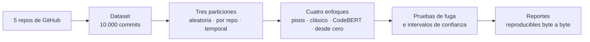

# Clasificador de commits por tipo de cambio

**Español** · [English](README.md)

¿Qué enfoque de aprendizaje automático clasifica mejor un commit de Git como `fix`, `feat`,
`refactor` o `docs`? Este proyecto compara **ML clásico**, **transfer learning** (CodeBERT) y
una **red entrenada desde cero** sobre 10.000 commits de 5 repositorios reales, y se
preocupa menos por el clasificador que por cuánto se puede creer cada número.

 



## Por qué importa cómo se evalúa

Un clasificador de commits da buenos números con facilidad si se evalúa mal. Aquí el punto de
partida es desconfiar:

- **La partición aleatoria infla el resultado unos 16 a 18 puntos de F1.** Reparte commits del
  mismo repositorio a los dos lados y el modelo memoriza el proyecto. La evaluación principal
  es **por repositorio**: cada repo se prueba con un modelo que no lo vio. También hay una
  partición temporal.
- **Las etiquetas salen del prefijo de Conventional Commits** (`fix:`, `feat:`…), que se
  quita de las entradas. Tres pruebas automáticas comprueban que no se cuele la respuesta
  (`LEAKAGE.md`), y cada una incluye fugas plantadas a propósito para demostrar que sabe
  fallar.
- **Cada modelo pasa la prueba de etiquetas aleatorias:** si se entrena con las etiquetas
  barajadas, debe dar el resultado del azar. Pasa en los tres modelos y en los 7 folds de cada
  uno.
- **Nada de "el mejor resultado":** cinco semillas por configuración, con media e intervalo de
  confianza en cada número.

## Resultado

F1 macro en la partición por repositorio, media de cinco semillas. En negrita, la media más
alta de la fila (no es un ganador: los intervalos se superponen en varios folds).

| repo en prueba | regla `docs` | clásico reponderado | CodeBERT | red desde cero |
|---|---:|---:|---:|---:|
| angular-cli | 39,2% | **68,9%** | 68,1% | 60,0% |
| nuxt | 43,0% | **67,6%** | 67,0% | 65,8% |
| svelte | 44,4% | 56,8% | **57,0%** | 52,7% |
| vite | 40,5% | **73,1%** | 71,0% | 67,6% |
| vitest | 39,1% | **68,3%** | 67,9% | 62,7% |
| temporal | 42,4% | 73,3% | **74,0%** | 70,1% |

1. **Ningún modelo profundo le gana al clásico reponderado.** CodeBERT empata con él en 5 de los
   6 folds honestos y pierde en vite. La red desde cero pierde en los 6, contra el clásico y
   contra CodeBERT: el preentrenamiento aporta entre 1,1 y 8,1 puntos con el mismo
   presupuesto de entrenamiento.
2. **`refactor` es donde se caen todos.** Es el 8,2% del dataset y casi todo de un repo. En
   angular-cli, el fold con más ejemplos, el clásico reponderado saca 55,4% de F1 en esa
   clase, CodeBERT 54,3% y la red desde cero 39,5%.
3. **`docs` casi no necesita modelo.** Una regla de una línea (todos los archivos tocados son
   `.md`, `.rst` o `.txt`) ya saca entre 0,80 y 0,91 de F1 en esa clase.
4. **Reponderar por clase ayuda** al F1 de las clases escasas, a costa de algo de exactitud.

Todas las tablas, con intervalos, matrices de confusión y `refactor` fold por fold, están en
[`RESULTS.md`](RESULTS.md). El análisis de 50 errores está en
[`ERROR-ANALYSIS.md`](ERROR-ANALYSIS.md).

## Probarlo

```powershell
python -m venv .venv
.\.venv\Scripts\pip install -r requirements.txt
.\.venv\Scripts\pip install -e .
.\.venv\Scripts\pytest -q                       # 254 tests
.\.venv\Scripts\python -m ccls reproducir --plan   # los pasos del pipeline, sin correr nada
```

`python -m ccls reproducir` corre el pipeline entero y regenera todos los reportes.
Sobre un dataset ya construido, `resultados/` y `docs/` salen **idénticos byte a byte**.
`--datos` reconstruye el dataset (clona los repos) y `--gpu` reentrena CodeBERT y la red
desde cero (necesita `requirements-f4.txt` y una GPU; las corridas son reanudables).
`python -m ccls results` regenera `RESULTS.md`.

## Qué hay en el repo

```
DESIGN.md            el diseño completo, escrito antes del código
RESULTS.md           los cuatro enfoques en las tres particiones (generado)
ERROR-ANALYSIS.md    50 errores revisados y agrupados por causa
LEAKAGE.md           las pruebas de fuga y sus cifras
NO-GOALS.md          qué NO es este proyecto
src/ccls/            el paquete: recolección, etiquetado, particiones, modelos, reportes
tests/               254 tests, incluidas las fugas plantadas a propósito
config/              repos, criterios de admisión, semillas, hiperparámetros fijados antes de entrenar
resultados/          un JSON por modelo × partición
docs/                un reporte generado por fase, más el estado detallado del proyecto
```

## Limitaciones

Lo que este proyecto **no** afirma, dicho de frente:

- **Diversidad de ecosistema, no tamaño.** Los 5 repos son TypeScript/JavaScript y tres de ellos
  (`vite`, `vitest`, `nuxt`) son de la misma comunidad. "Un repo que el modelo nunca vio"
  significa aquí otro proyecto TS/JS, así que se mide generalización **dentro de un
  ecosistema**, no a proyectos nuevos en general. Más repos del mismo perfil empeorarían justo
  eso.
- **Sesgo de selección.** Solo entran repos que ya siguen Conventional Commits, porque de ahí
  salen las etiquetas. El caso de uso real (repos sin convención) queda fuera del entrenamiento.
- **No hay techo humano.** La comparación con un anotador se hizo con un LLM (Claude), no con una
  persona: coincide con la etiqueta declarada en 81,4% [73,4; 89,5] y el clásico en 78,9%
  [71,0; 86,8], con intervalos que se superponen. Ese número no es un techo humano y puede estar
  inflado (`docs/F3_TECHO_LLM.md`). La herramienta para etiquetar a mano existe
  (`python -m ccls f3 label`).
- **El análisis de errores no lo revisó una persona.** Las causas de los 50 errores las propuso
  el asistente y las revisó en una segunda pasada con el diff; están en estado `revisada`, no
  `confirmada`. Solo se revisó el clásico de referencia, y la muestra pesa igual a todos los
  repos, así que no da la tasa de cada causa.
- **La red desde cero no es la mejor posible.** Usa los hiperparámetros de CodeBERT, fijados
  antes de entrenar; buscar otros obligaba a elegir mirando los folds de prueba.
- **CI:** `.github/workflows/ci.yml` existe pero no ha corrido nunca, porque la cuenta de
  GitHub tiene la facturación bloqueada. La verificación es local (`pytest -q`).

## Documentación

| Documento | Qué es |
|---|---|
| [`DESIGN.md`](DESIGN.md) | El diseño, las particiones, las métricas y por qué |
| [`LEAKAGE.md`](LEAKAGE.md) | Las tres pruebas de fuga con todas las cifras |
| [`RESULTS.md`](RESULTS.md) | Resultados completos, generados |
| [`ERROR-ANALYSIS.md`](ERROR-ANALYSIS.md) | El análisis de errores |
| [`docs/ESTADO.md`](docs/ESTADO.md) | Estado fase por fase, piloto, dataset y detalle de los baselines |
| [`docs/F2_BASELINES.md`](docs/F2_BASELINES.md), [`F4_TRANSFER.md`](docs/F4_TRANSFER.md), [`F5_DESDE_CERO.md`](docs/F5_DESDE_CERO.md) | Un reporte por fase |
| [`NO-GOALS.md`](NO-GOALS.md) | Los límites del proyecto |
