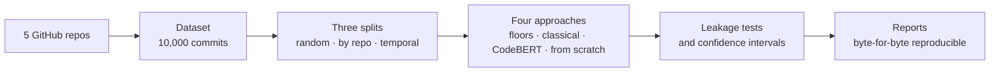

# Commit type classifier

[Español](README.es.md) · **English**

Which machine-learning approach classifies a Git commit best as `fix`, `feat`, `refactor` or
`docs`? This project compares **classical ML**, **transfer learning** (CodeBERT) and a
**network trained from scratch** on 10,000 commits from 5 real repositories. It cares less
about the classifier than about how far each number can be trusted.




## Why the evaluation is the point

A commit classifier can look good very easily if it is evaluated badly. The starting point
here is distrust:

- **A random split inflates the result by roughly 16 to 18 F1 points.** It puts commits from
  the same repository on both sides, and the model memorizes the project. The main evaluation
  is **by repository**: each repo is tested with a model that never saw it. There is also a
  temporal split.
- **The labels come from the Conventional Commits prefix** (`fix:`, `feat:`…), which is removed
  from the inputs. Three automated tests check that the answer does not leak in
  (`LEAKAGE.md`), and each includes leaks planted on purpose to prove it can fail.
- **Every model passes the random-label test:** trained on shuffled labels, it must score at
  chance level. It passes for all three models and all 7 folds of each.
- **No "best run" reporting:** five seeds per configuration, with a mean and a confidence
  interval on every number.

## Results

Macro F1 on the by-repository split, mean of five seeds. Bold is the highest mean in the row
(not a winner: the intervals overlap in several folds).

| test repo | `docs` rule | reweighted classical | CodeBERT | from scratch |
|---|---:|---:|---:|---:|
| angular-cli | 39.2% | **68.9%** | 68.1% | 60.0% |
| nuxt | 43.0% | **67.6%** | 67.0% | 65.8% |
| svelte | 44.4% | 56.8% | **57.0%** | 52.7% |
| vite | 40.5% | **73.1%** | 71.0% | 67.6% |
| vitest | 39.1% | **68.3%** | 67.9% | 62.7% |
| temporal | 42.4% | 73.3% | **74.0%** | 70.1% |

1. **No deep model beats the reweighted classical baseline.** CodeBERT ties with it in 5 of
   the 6 honest folds and loses on vite. The network from scratch loses in all 6, against both
   the classical model and CodeBERT: pretraining is worth between 1.1 and 8.1 points at the
   same training budget.
2. **`refactor` is where everything falls apart.** It is 8.2% of the dataset and mostly from
   one repo. On angular-cli, the fold with the most examples, the reweighted classical model
   gets 55.4% F1 on that class, CodeBERT 54.3% and the network from scratch 39.5%.
3. **`docs` barely needs a model.** A one-line rule (every touched file is `.md`, `.rst` or
   `.txt`) already reaches 0.80 to 0.91 F1 on that class.
4. **Reweighting by class helps** the F1 of the scarce classes, at some cost in accuracy.

Every table, with intervals, confusion matrices and `refactor` fold by fold, is in
[`RESULTS.md`](RESULTS.md). The analysis of 50 errors is in
[`ERROR-ANALYSIS.md`](ERROR-ANALYSIS.md).

## Try it

```powershell
python -m venv .venv
.\.venv\Scripts\pip install -r requirements.txt
.\.venv\Scripts\pip install -e .
.\.venv\Scripts\pytest -q                          # 254 tests
.\.venv\Scripts\python -m ccls reproducir --plan   # the pipeline steps, without running anything
```

`python -m ccls reproducir` runs the whole pipeline and regenerates every report. On an
already-built dataset, `resultados/` and `docs/` come out **byte-for-byte identical**.
`--datos` rebuilds the dataset (it clones the repos) and `--gpu` retrains CodeBERT and the
network from scratch (needs `requirements-f4.txt` and a GPU; runs are resumable).
`python -m ccls results` regenerates `RESULTS.md`.

The CLI, the code and the documents other than this README are in Spanish.

## What is in the repo

```
DESIGN.md            the full design, written before the code
RESULTS.md           the four approaches on the three splits (generated)
ERROR-ANALYSIS.md    50 errors reviewed and grouped by cause
LEAKAGE.md           the leakage tests and their numbers
NO-GOALS.md          what this project is NOT
src/ccls/            the package: collection, labelling, splits, models, reports
tests/               254 tests, including leaks planted on purpose
config/              repos, admission criteria, seeds, hyperparameters fixed before training
resultados/          one JSON per model × split
docs/                one generated report per phase, plus the detailed project status
```

## Limitations

What this project does **not** claim, stated plainly:

- **Ecosystem diversity, not size.** All 5 repos are TypeScript/JavaScript, and three of them
  (`vite`, `vitest`, `nuxt`) come from the same community. "A repo the model never saw" here
  means another TS/JS project, so what is measured is generalization **within one ecosystem**,
  not to new projects in general. More repos of the same profile would make exactly that worse.
- **Selection bias.** Only repos that already follow Conventional Commits are included, because
  that is where the labels come from. The real use case (repos without a convention) is outside
  the training data.
- **There is no human ceiling.** The comparison against an annotator was done with an LLM
  (Claude), not a person: it agrees with the declared label 81.4% of the time [73.4, 89.5], the
  classical model 78.9% [71.0, 86.8], with overlapping intervals. That number is not a human
  ceiling and may be inflated (`docs/F3_TECHO_LLM.md`). The tool for labelling by hand exists
  (`python -m ccls f3 label`).
- **The error analysis was not reviewed by a person.** The causes of the 50 errors were proposed
  by the assistant and revised in a second pass that also read the diff; they are in state
  `revisada`, not `confirmada`. Only the classical reference model was reviewed, and the sample
  weights every repo equally, so it does not give the rate of each cause.
- **The network from scratch is not the best possible one.** It uses CodeBERT's hyperparameters,
  fixed before training; searching for others would have meant choosing while looking at the
  test folds.
- **CI:** `.github/workflows/ci.yml` exists but has never run, because the GitHub account has
  billing blocked. Verification is local (`pytest -q`).

## Documentation

| Document | What it is |
|---|---|
| [`DESIGN.md`](DESIGN.md) | The design, the splits, the metrics and why |
| [`LEAKAGE.md`](LEAKAGE.md) | The three leakage tests with all the numbers |
| [`RESULTS.md`](RESULTS.md) | Full results, generated |
| [`ERROR-ANALYSIS.md`](ERROR-ANALYSIS.md) | The error analysis |
| [`docs/ESTADO.md`](docs/ESTADO.md) | Phase-by-phase status, pilot, dataset and baseline details |
| [`docs/F2_BASELINES.md`](docs/F2_BASELINES.md), [`F4_TRANSFER.md`](docs/F4_TRANSFER.md), [`F5_DESDE_CERO.md`](docs/F5_DESDE_CERO.md) | One report per phase |
| [`NO-GOALS.md`](NO-GOALS.md) | The project's limits |
